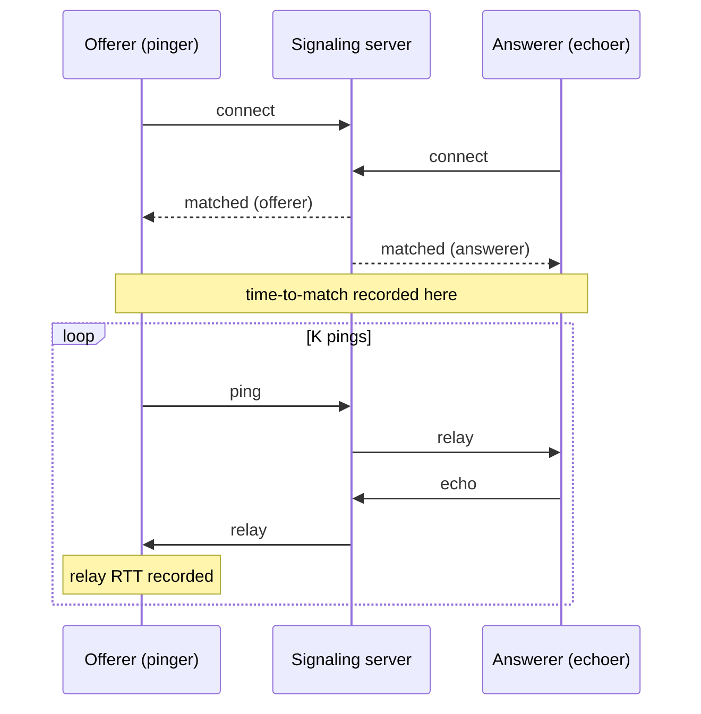

# Benchmarks

## Strategy

Validation proves the system is **correct**; benchmarking proves it **scales**. The benchmark
targets the only always-on, centrally-coordinated component — the **signaling server**. The
P2P gameplay path (WebRTC, rollback) is peer-to-peer and carries no central load, so it is out
of scope here.

The signaling server does two jobs, and the benchmark measures exactly those:

| Metric | What it measures | Why it matters |
|--------|------------------|----------------|
| **Time-to-match** | Latency from a client connecting to receiving its `matched` message, under a burst of `2N` simultaneous joins | How fast players are paired when many queue at once |
| **Relay RTT** | Round-trip latency of a message relayed through a room (`offerer → server → answerer → server → offerer`) | The latency the SDP/ICE handshake actually experiences |

Both are reported across a **sweep** of increasing concurrent rooms, so we can see how they
degrade under load.

## Harness

A self-contained Go program lives in `benchmarks/signaling/`. It speaks the server's
matchmaking protocol directly — no external load-testing tool, no new global dependencies
(only `gorilla/websocket`, pinned to the same version the server uses).

For each sweep level it dials `2N` WebSocket clients concurrently. The server pairs them into
`N` rooms, assigning each room one **offerer** and one **answerer**. The harness uses that
guarantee instead of controlling pairing:



- **Offerer** records its time-to-match, then drives `K` sequential ping → pong round-trips.
- **Answerer** records its time-to-match, then echoes every relayed message straight back.

Because every room has exactly one offerer and one answerer by construction, the harness is
robust even if the server's at-most-one-deep matchmaking queue cross-pairs clients.

## Running

Start the signaling server first, then run the benchmark:

```bash
make signaling            # Docker (exposes :8080)
# or: cd signaling_server && go run .   # docker-free local run

make bench-signaling      # full sweep → benchmarks/RESULTS.md
```

Pass options through `BENCH_ARGS`:

```bash
make bench-signaling BENCH_ARGS="-sweep 1,5 -pings 5"
```

| Flag | Default | Meaning |
|------|---------|---------|
| `-url` | `ws://localhost:8080/ws` | signaling server WebSocket URL |
| `-sweep` | `1,10,50,100,250,500` | comma-separated room counts to test |
| `-rooms` | `0` | single room count (overrides `-sweep`) |
| `-pings` | `20` | relay round-trips measured per room |
| `-out` | `../RESULTS.md` | markdown results file (empty string to skip) |
| `-timeout` | `30s` | per-level safety timeout |

!!! note "File descriptors"
    The top sweep level (`500` rooms) opens `1000` sockets at once. macOS defaults to a low
    descriptor limit — if you see dial errors at high levels, raise it for the shell with
    `ulimit -n 4096` before running.

## Results

Representative localhost run (`-pings 20`, Apple Silicon, server via `go run`):

| Rooms | Clients | Matched | Match/s | Match p50 | Match p95 | Match p99 | Relay p50 | Relay p95 | Relay p99 | Errors |
|-------|---------|---------|---------|-----------|-----------|-----------|-----------|-----------|-----------|--------|
| 1 | 2 | 2/2 | 285 | 3.47ms | 3.48ms | 3.48ms | 605µs | 1.05ms | 1.17ms | 0 |
| 10 | 20 | 20/20 | 598 | 12.49ms | 16.20ms | 16.70ms | 1.12ms | 2.21ms | 6.43ms | 0 |
| 50 | 100 | 100/100 | 1457 | 20.42ms | 33.76ms | 33.94ms | 2.06ms | 3.90ms | 4.88ms | 0 |
| 100 | 200 | 200/200 | 1739 | 28.87ms | 54.02ms | 54.64ms | 3.16ms | 5.47ms | 7.70ms | 0 |
| 250 | 500 | 500/500 | 2642 | 66.07ms | 92.08ms | 93.08ms | 6.63ms | 11.57ms | 16.28ms | 0 |
| 500 | 1000 | 1000/1000 | 2524 | 95.57ms | 185.73ms | 193.78ms | 21.20ms | 51.53ms | 67.65ms | 0 |

### Interpretation

- **Correctness under load** — every client matched at every level (`1000/1000` at the top),
  with zero dial or protocol errors. The matchmaking queue and per-room relay hold up to 1000
  concurrent connections.
- **Graceful degradation** — both metrics rise smoothly with no cliff. Relay p50 stays
  sub-millisecond-to-low-millisecond up to 250 rooms and reaches ~21ms at 500 rooms; match p50
  climbs from ~3ms to ~95ms. The growth tracks contention on the single global matchmaking
  mutex rather than any failure mode.
- **Throughput** — matched rooms per second scales up to ~2.6k, flattening near the top level
  as connection-setup contention dominates.

!!! warning "Localhost only"
    These numbers isolate **server overhead**: they exclude real WAN latency and NAT
    traversal. In production the relay RTT is dominated by network round-trips between players
    and the server, not by the server itself — which is the point. The server adds single-digit
    milliseconds even under heavy load.

Results are regenerated into `benchmarks/RESULTS.md` on every run; see `benchmarks/README.md`
for harness details.
