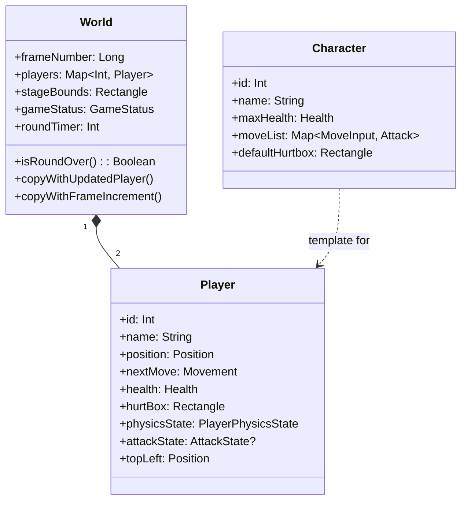

# Design

This section covers domain modelling, state management, interaction patterns, and how the system handles consistency and faults. For the layer-by-layer architecture breakdown, see [Architecture](architecture.md). For networking specifics, see [Networking](networking.md).

## Domain Model

### Entities



**`World`** is the single source of truth for any given frame. It's an immutable `data class` — each simulation step produces a new `World` via `copy()`, never mutates the old one. This is what makes deterministic lockstep and future rollback possible.

**`Player`** is a fighter instance with position, velocity, health, collision box, physics state, and optional attack state.

**`Character`** is a fighter archetype (name, base health, move list). Defined but not yet wired into character selection.

### Components (Value Objects)

| Component | Purpose |
|-----------|---------|
| `Position` / `Direction` | 2D coordinates and direction vectors |
| `Movement` | Bundles direction, position, and speed |
| `Rectangle` | AABB with `overlaps()` for collision detection |
| `Health` | Current and max HP |
| `InputState` | Bitmask of pressed `GameButton`s (value class wrapping `Int`) |
| `InputBuffer` | 60-frame circular history for future combo detection |
| `Attack` | Damage, hitbox, frame data (startup/active/recovery), hitstun, knockback |
| `AttackState` | Tracks an in-progress attack: current frame, phase, whether it has landed |
| `PlayerPhysicsState` | Current `PlayerState` enum + hitstun frames remaining |

### State Enums

```kotlin
enum class PlayerState { IDLE, WALKING, JUMPING, ATTACKING, HITSTUN, BLOCKSTUN }
enum class GameStatus  { RUNNING, PAUSED, ROUND_END, MATCH_END }
enum class AttackPhase { STARTUP, ACTIVE, RECOVERY }
```

## Game State Flow

Each frame, the game logic pipeline runs these systems in order:

```
InputSystem  →  AttackSystem  →  PhysicsSystem  →  HitDetectionSystem  →  GameRules  →  frame++
```

All systems are **stateless pure functions**: `(World, ...) → World`. No system holds mutable state.

| System | Input | Output |
|--------|-------|--------|
| `InputSystem` | `World` + `Map<Int, InputState>` | Updated player movement/direction/attack. Blocks input during HITSTUN and decrements hitstun counter |
| `AttackSystem` | `World` | Advances `currentFrame` on active attacks. Clears expired attacks |
| `PhysicsSystem` | `World` + `dt` | Applies gravity, horizontal movement, floor collision, stage bounds. Applies knockback friction during HITSTUN |
| `HitDetectionSystem` | `World` | Checks hitbox/hurtbox overlap. On hit: applies damage, sets HITSTUN, applies knockback velocity |
| `GameRules` | `World` | Decrements round timer every 60 frames. Sets ROUND_END when timer or HP reaches 0 |

## Interaction Patterns

### Per-Frame Lifecycle (Local)

```
KeyPress → ComposeAdapter.press() → bitmask updated
                                          ↓
                            GameLoop polls bitmask → InputState
                                          ↓
                            GameEngine.step(inputs, fixedDt)
                                          ↓
                            RenderPort.render(newWorld)
                                          ↓
                            ComposeAdapter.worldState = newWorld
                                          ↓
                            Compose recomposition → screen redraws
```

### Per-Frame Lifecycle (Networked)

```
Local: pollInputState() ─────────────────────────── Remote: pollInputState()
         │                                                      │
         ├─► sendInput(local, frame) ══════════════► receivedInputs[frame]
         │                                                      │
         │   receivedInputs[frame] ◄══════════════ sendInput(remote, frame) ◄─┤
         │                                                      │
         ▼                                                      ▼
GameEngine.step({1: local, 2: remote})          GameEngine.step({1: remote, 2: local})
         │                                                      │
         ▼                                                      ▼
    render(world)                                          render(world)
```

Both machines run the same `GameLogic.step()` with the same inputs. Because the logic is deterministic and the timestep is fixed, both produce identical `World` states.

## Data and Consistency

### State Ownership
There is no authoritative server. Both peers compute game state independently from shared inputs. Consistency is guaranteed by:

1. **Deterministic logic** — pure functions, no randomness, no floating-point order dependence
2. **Fixed timestep** — physics always advances at 1/60s, regardless of actual frame rate
3. **Immutable state** — `data class` + `copy()` prevents accidental mutation
4. **Lockstep synchronization** — neither peer advances until both inputs for a frame are available

### Thread Safety
Two threads share data:

| Thread | Reads | Writes |
|--------|-------|--------|
| Game loop | `ComposeAdapter.bitmask`, `NetworkAdapter.receivedInputs` | `ComposeAdapter.worldState`, `NetworkAdapter.sendInput()` |
| UI / JNI callbacks | `ComposeAdapter.worldState` | `ComposeAdapter.bitmask`, `NetworkAdapter.receivedInputs` |

- `ComposeAdapter.worldState` uses Compose's `mutableStateOf` (thread-safe observable)
- `ComposeAdapter.bitmask` uses `@Volatile` (atomic read/write of `Int`)
- `NetworkAdapter.receivedInputs` uses `ConcurrentHashMap` (thread-safe map)

## Fault Tolerance

### Peer Disconnection
If the remote peer disconnects, `pollRemoteInput()` blocks indefinitely (no input arrives for the next frame). The game loop stalls.

**Current mitigation**: graceful shutdown via `onDataChannelClose()` callback — the game exits cleanly instead of hanging.

**Limitation**: no reconnection or timeout. This is acceptable for local/LAN play. Future rollback netcode would handle this more gracefully with input prediction.

### Signaling Server Failure
The signaling server is only needed during connection setup. Once the P2P connection is established, the signaling server can go down without affecting gameplay.

## Security

WebRTC encrypts the data channel with **DTLS** (Datagram Transport Layer Security). Input packets cannot be read or tampered with by a network observer.

There is no authentication — any two clients that reach the signaling server can connect. This is acceptable for the current scope (direct play between known players).
