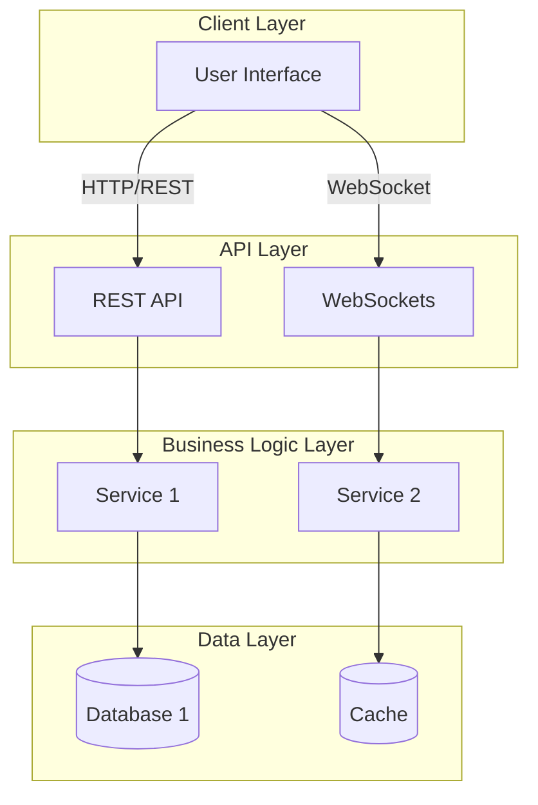

# Design - Architecture

## Architectural Style

Choose and justify your architectural style:

- **Monolithic** - Single, unified application
- **Microservices** - Multiple loosely-coupled services
- **Layered** - Separation into horizontal layers
- **Hexagonal (Ports & Adapters)** - Core domain with external dependencies
- **Event-Driven** - Components communicate through events
- **Peer-to-Peer (P2P)** - Distributed without central authority
- **Hybrid** - Combination of multiple styles

### Selected Architecture: [Architecture Name]

**Justification**: 
Why was this architecture chosen? How does it address the identified requirements and distributed system features?

[Your analysis here]

### Trade-offs

Discuss the trade-offs of this architectural choice:

| Advantage | Disadvantage |
|-----------|--------------|
| [Pro 1]   | [Con 1]      |
| [Pro 2]   | [Con 2]      |

## Architectural Diagram

Include a high-level diagram showing the major components and their relationships:

## Design Principles

List the key design principles guiding this architecture:

- **Principle 1**: [Description and justification]
- **Principle 2**: [Description and justification]
- **Principle 3**: [Description and justification]

## Constraints and Dependencies

Identify any architectural constraints:

- **Constraint 1**: [Description]
- **Constraint 2**: [Description]
