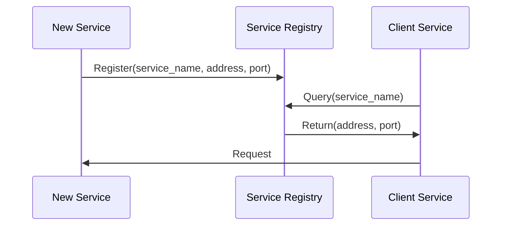
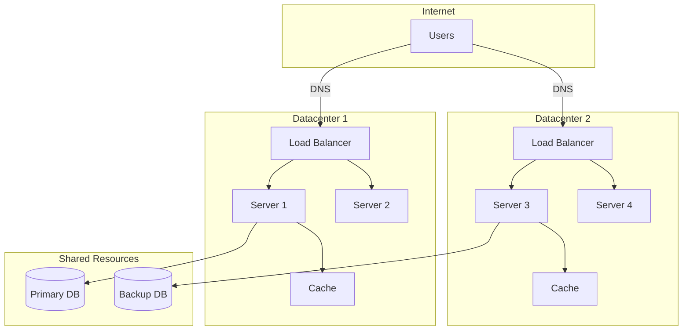

# Design - Infrastructure

## System Components

Describe the infrastructural components needed:

| Component     | Type                  | Purpose   | Count    |
|---------------|-----------------------|-----------|----------|
| [Component 1] | Server/Client/Service | [Purpose] | [Number] |
| [Component 2] | Database/Cache        | [Purpose] | [Number] |

### Component Types Reference

- **Clients** - User-facing interfaces
- **Servers** - Backend services processing requests
- **Load Balancers** - Distributing traffic
- **Caches** - In-memory data stores
- **Databases** - Persistent data storage
- **Message Brokers** - Asynchronous messaging systems
- **Queues** - Task/message queuing
- **Workers** - Background task processors
- **Proxies** - Request routing and transformation
- **Firewalls** - Network security
- **CDNs** - Content delivery networks
- **Other** - [Specify]

## Component Distribution

### Physical Distribution

Describe how components distribute across the network:

```
┌─────────────────────────────────────────┐
│ User's Machine / Browser                │
│ ┌─────────────────────────────────────┐ │
│ │ Client Application                  │ │
│ └─────────────────────────────────────┘ │
└────────────┬────────────────────────────┘
             │ Internet
             │
    ┌────────┴─────────┐
    │                  │
┌───▼───┐          ┌───▼───┐
│ Serv. │          │ Serv. │
│  DC1  │          │  DC2  │
└───┬───┘          └───┬───┘
    │                  │
    │   ┌─────────┐    │
    └──▶│Database │◀───┘
       └─────────┘
```

**Distribution Strategy**:

- **Geographically distributed** - Components in different datacenters/regions
- **Same datacenter** - Components co-located
- **Same machine** - Components on single server
- **Hybrid** - Mix of approaches

[Your description here]

## Service Discovery

### How Components Find Each Other

Describe the mechanism for service discovery:

- **DNS** - Traditional domain name resolution
- **Service Discovery** - Dynamic service registry (e.g., Consul, Eureka)
- **Load Balancing** - Through dedicated load balancers
- **Hardcoded Addresses** - Static configuration
- **Other** - [Specify]

### Naming Convention

Define how components are named:

- **URL/Hostname**: `[service-name].[domain]:[port]`
- **IP Address**: `[static-ip]`
- **Service ID**: `[service-identifier]`
- **Other**: [Specify naming scheme]

### Registration and Discovery Process

Describe the process:

1. Component starts and registers with service registry
2. [Additional steps...]
3. Other components query registry to find services



## Infrastructure Topology

### Network Architecture



## Deployment Environments

Define different deployment environments:

### Development

- **Components**: [Components in dev environment]
- **Location**: [Where development runs]
- **Purpose**: [Development, testing, debugging]

### Staging

- **Components**: [Components in staging]
- **Location**: [Where staging runs]
- **Purpose**: [Pre-production testing]

### Production

- **Components**: [Components in production]
- **Location**: [Where production runs]
- **Purpose**: [Live user-facing system]
