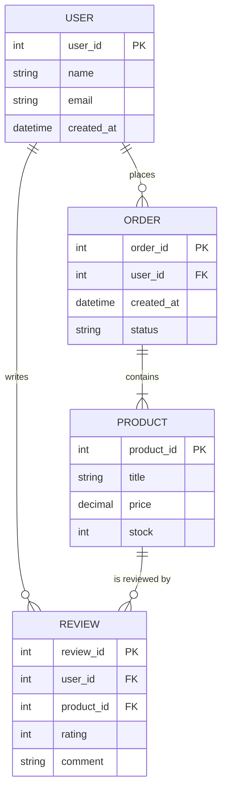
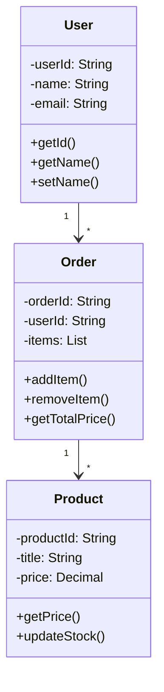

# Design - Modelling

## Domain Entities

Identify the core domain entities in your system:

### Entity: [Entity Name]

**Description**: [What does this entity represent?]

**Attributes**:
- `attribute1` (type): [Description]
- `attribute2` (type): [Description]
- `attribute3` (type): [Description]

**Relationships**:
- [Relationship to other entities]

---

### Entity: [Entity Name]

[Continue with additional entities...]

## Entity to Infrastructure Mapping

Describe how domain entities map to infrastructural components:

| Domain Entity | Storage Location | Component(s)       | Purpose             |
|---------------|------------------|--------------------|---------------------|
| [Entity 1]    | [Database/Cache] | [Server/Component] | [Why stored there?] |
| [Entity 2]    | [Database/Cache] | [Server/Component] | [Why stored there?] |

### Mapping Examples

- **User State** - Stored on central server; replicated to cache for fast access
- **Game State** - Distributed across clients with server validation
- **Messages** - Queue on broker; persisted in database
- [Your examples...]

## Domain Events

Identify significant domain events that occur in your system:

### Event: [Event Name]

**When**: [When does this event occur?]

**Triggered By**: [What causes this event?]

**Affected Entities**: [Which entities are involved?]

**Actions**: [What happens as a result?]

**Data Carried**:
```json
{
  "event_id": "unique_identifier",
  "timestamp": "ISO8601_timestamp",
  "entity_id": "affected_entity",
  "data": {
    "field1": "value1",
    "field2": "value2"
  }
}
```

---

### Event: [Event Name]

[Continue with additional events...]

## Message Types

Define the types of messages exchanged between components:

### Command Messages

**Purpose**: Trigger an action or state change

**Example: [Command Name]**

```json
{
  "type": "command",
  "command_type": "CreateUser",
  "user_id": "user123",
  "name": "John Doe",
  "email": "john@example.com"
}
```

---

### Query Messages

**Purpose**: Request information without side effects

**Example: [Query Name]**

```json
{
  "type": "query",
  "query_type": "GetUser",
  "user_id": "user123"
}
```

---

### Event Messages

**Purpose**: Notify about state changes

**Example: [Event Name]**

```json
{
  "type": "event",
  "event_type": "UserCreated",
  "user_id": "user123",
  "timestamp": "2025-11-11T21:00:00Z"
}
```

---

### Response Messages

**Purpose**: Return results from queries or commands

**Example: [Response Name]**

```json
{
  "type": "response",
  "status": "success",
  "data": {
    "user_id": "user123",
    "name": "John Doe"
  }
}
```

## System State

### State Definition

Describe what constitutes the state of your system:

**Global State Components**:
- [State component 1]:
- [State component 2]: 
- [State component 3]: 

### State Consistency

How is state consistency maintained across distributed components?

- **Single Source of Truth**: Central authority (database, server)
- **Eventual Consistency**: Components eventually agree
- **Strong Consistency**: All components always synchronized
- **Hybrid**: Different consistency for different data

[Your approach here]

### State Versioning

How is state versioning handled?

- **Timestamp-based**: Version based on last modification time
- **Version number**: Explicit version counter
- **Event sourcing**: Derived from event history
- [Other approach...]

## Entity-Relationship Diagram

Include an ER diagram showing entity relationships:



## Class Diagram

Include a UML class diagram representing your domain model:


