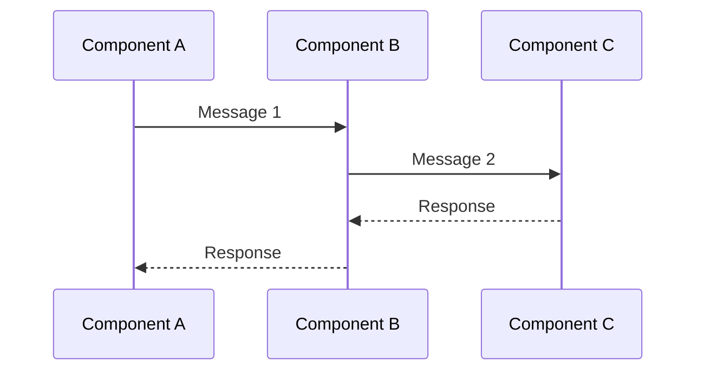
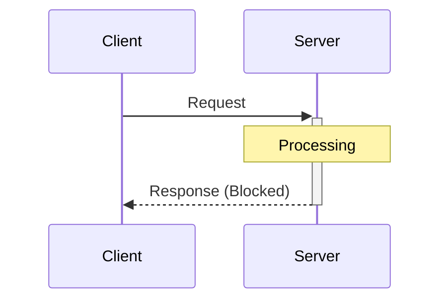
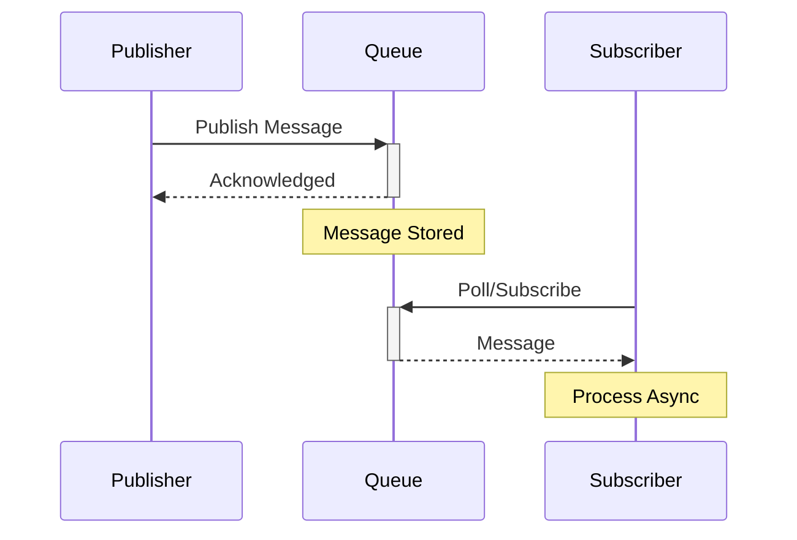
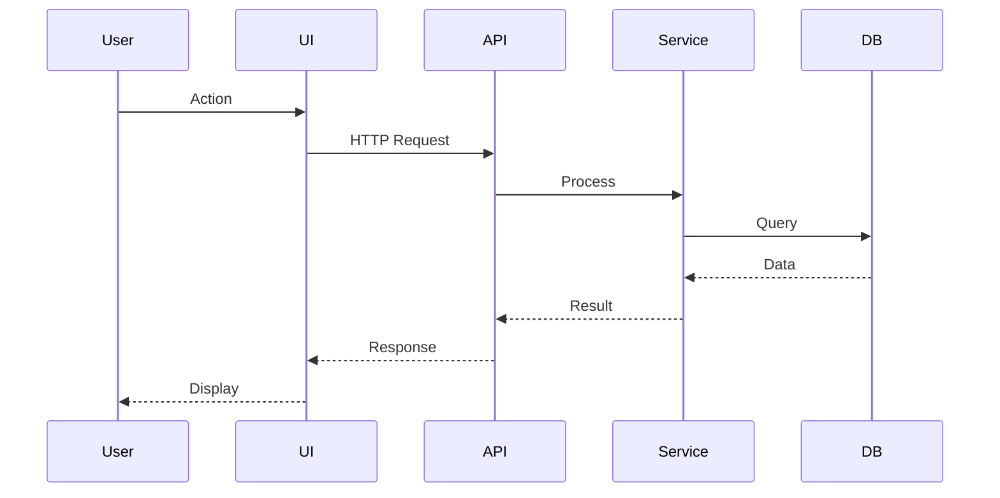

# Design - Interaction

## Communication Patterns

Describe how components communicate and interact:

### Pattern: [Pattern Name]

**Description**: [What is this pattern and when is it used?]

**Components Involved**: [Which components participate?]

**Message Flow**: 

**Timing**: [Synchronous/Asynchronous]

**Reliability**: [At-most-once / At-least-once / Exactly-once]

---

### Pattern: [Pattern Name]

[Continue with additional patterns...]

## Synchronous vs Asynchronous Communication

### Synchronous Communication

**When Used**: [Explain use cases]

**Examples**:
- Request-response over HTTP/REST
- RPC (Remote Procedure Call)
- WebSocket bidirectional communication

**Diagram**:

### Asynchronous Communication

**When Used**: [Explain use cases]

**Examples**:
- Message queues
- Event pub/sub
- Fire-and-forget messages

**Diagram**:

## Interaction Scenarios

### Scenario: [Scenario Name]

**Preconditions**: [Initial state]

**Steps**:
1. [Step 1]
2. [Step 2]
3. [Step 3]

**Expected Outcome**: [Final state and results]

**Error Cases**: [What could go wrong?]

**Sequence Diagram**:

---

### Scenario: [Scenario Name]

[Continue with additional scenarios...]

