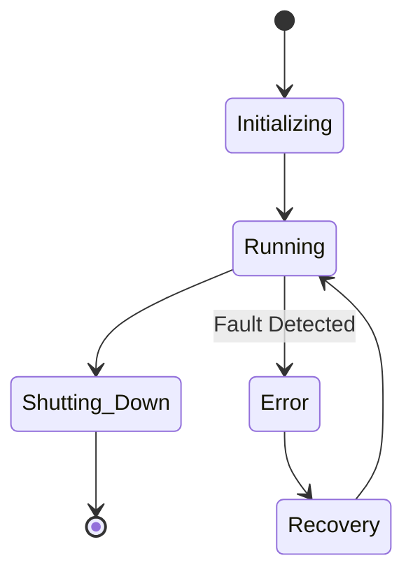
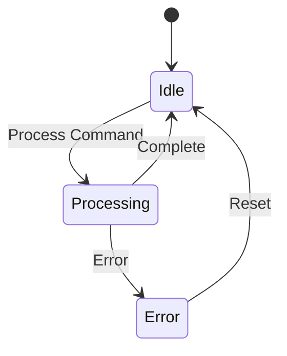
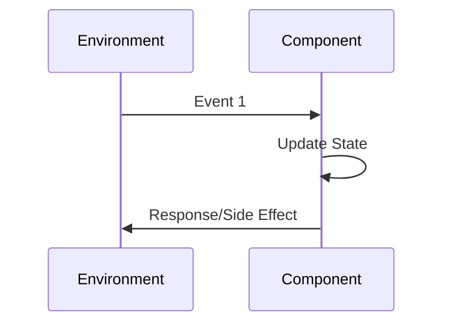
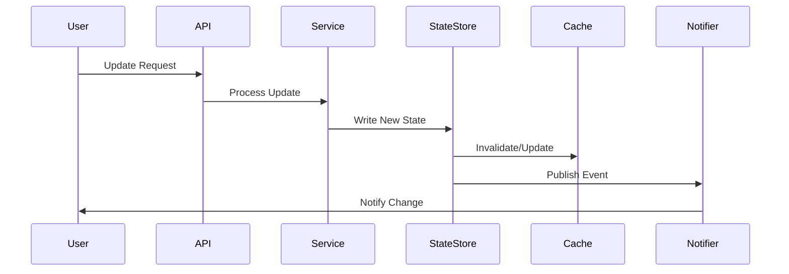
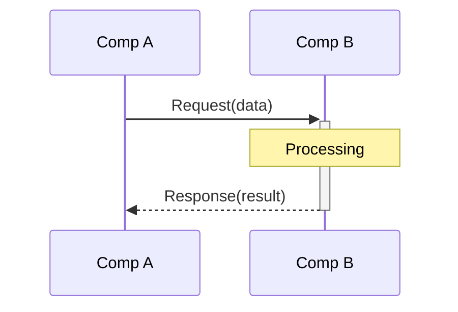
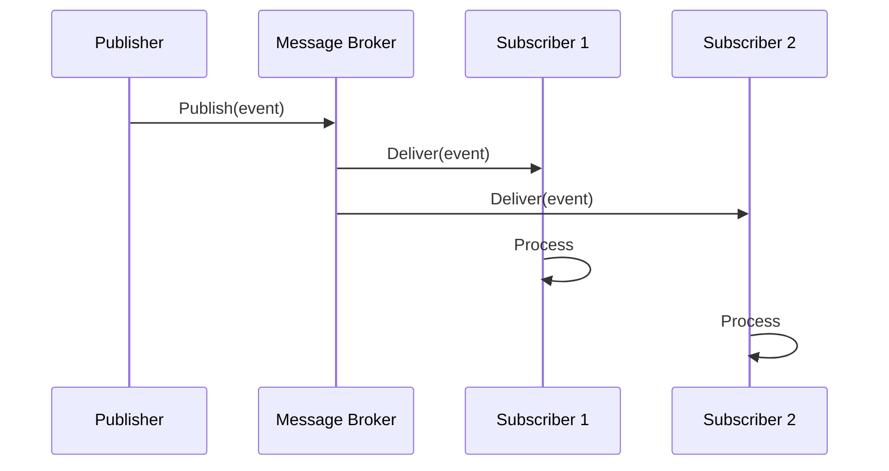
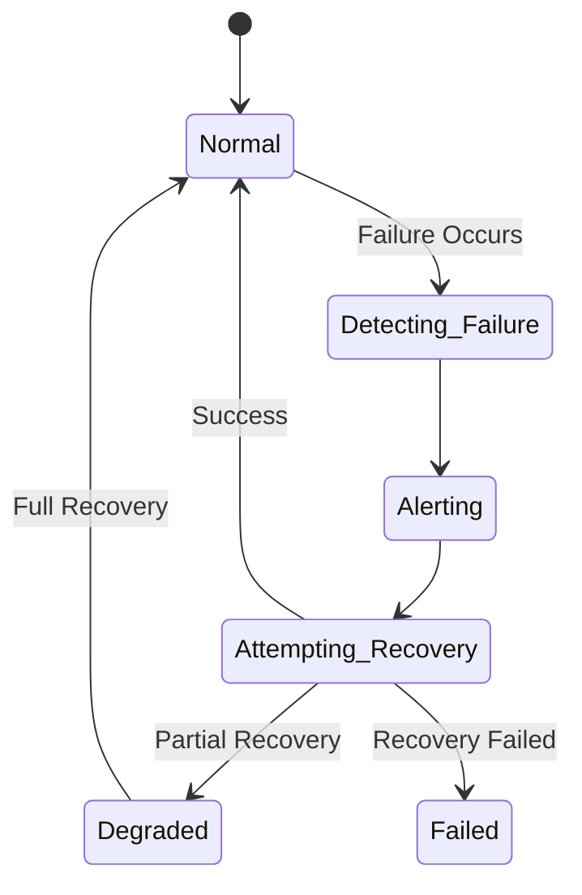

# Design - Behaviour

## Component Lifecycle

### Component: [Component Name]

**Initialization**:
- [Startup step 1]
- [Startup step 2]
- [Configuration loading]

**Running State**:
- [Main operation 1]
- [Main operation 2]
- [Event handling]

**Shutdown**:
- [Graceful shutdown steps]
- [Resource cleanup]
- [State persistence]

**Lifecycle Diagram**:

---

### Component: [Component Name]

[Continue with additional components...]

## State Management

### Stateful Components

Describe components that maintain state:

**Component: [Component Name]**

**State Variables**:
- `state_var1` (type): [Description]
- `state_var2` (type): [Description]

**State Transitions**:

**State Persistence**: [How is state saved?]

---

### Stateless Components

**Purpose**: [These components don't maintain state]

**Advantages**: [Easier scaling, no coordination needed]

**Examples**: [Load balancers, API gateways]

## Individual Component Behaviors

### Component: [Component Name]

**Responsibilities**: [What does this component do?]

**Triggers**: [What causes it to act?]

**Responses**: [What does it do in response?]

**State Management**: [Stateful or stateless?]

**Event Handling**:

**Error Handling**: [How are errors handled?]

---

### Component: [Component Name]

[Continue with additional components...]

## System State Updates

### Who Updates System State?

Identify which components are responsible for updating each type of state:

| State Element | Owner Component | Update Frequency | Update Method |
|---------------|-----------------|------------------|---------------|
| [State 1]     | [Component]     | [Frequency]      | [Method]      |
| [State 2]     | [Component]     | [Frequency]      | [Method]      |

### When and How State is Updated

**Synchronous Updates**:
- [Direct state change on component]
- [Immediate consistency]

**Asynchronous Updates**:
- [Event-driven state changes]
- [Eventual consistency]

**Example State Update Flow**:

## Consistency Guarantees

### Strong Consistency

**Definition**: All reads return the latest written value

**When Achieved**: 
- [Approach 1]
- [Approach 2]

**Trade-offs**: [Higher latency, reduced availability]

### Eventual Consistency

**Definition**: Replicas eventually converge to same state

**Convergence Time**: [Expected time to consistency]

**Conflict Resolution**: [How are conflicts resolved?]

**Trade-offs**: [Lower latency, temporary inconsistencies]

### Causal Consistency

**Definition**: Related operations respect causal ordering

**Implementation**: [How is this achieved?]

## Component Interaction Patterns

### Request-Response Pattern

**Flow**:
1. Component A sends request to Component B
2. Component B processes request
3. Component B sends response
4. Component A receives response

**Example**:

### Publish-Subscribe Pattern

**Flow**:
1. Publisher emits event
2. All subscribers receive event
3. Subscribers process independently

**Example**:

### Observer Pattern

**Components**: [Which components observe which?]

**Events Observed**: [What events trigger notifications?]

**Update Mechanism**: [Pull vs Push]

## Failure Handling

### Component Failure

**Detection**: [How are failures detected?]

**Response**: [What happens when a failure is detected?]

**Recovery**: [How does the component recover?]

### Message Failure

**Lost Message**: [How are lost messages handled?]

**Duplicates**: [How are duplicate messages handled?]

**Out-of-Order**: [How are out-of-order messages handled?]
