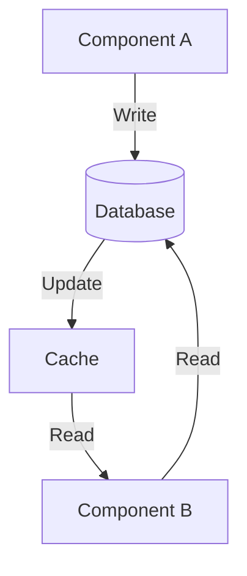
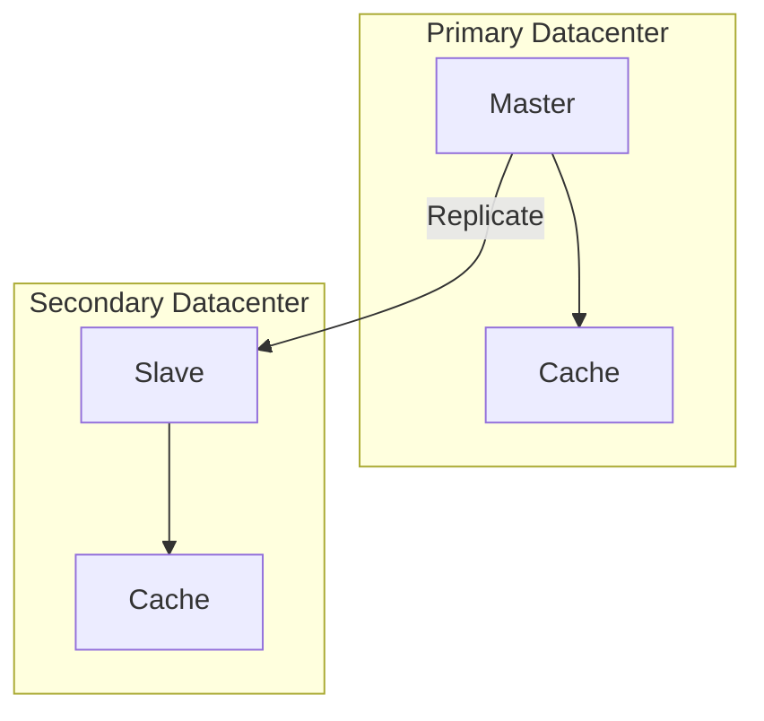

# Design - Data and Consistency Issues

## Data Persistence

### What Data Needs to be Stored?

Identify all persistent data in the system:

| Data Element | Description          | Reason for Storage | Size Estimate  |
|--------------|----------------------|--------------------|----------------|
| [Data 1]     | [What it represents] | [Why store it?]    | [Approx. size] |
| [Data 2]     | [What it represents] | [Why store it?]    | [Approx. size] |

### Where Should Data be Stored?

**Storage Options**:
- **Relational Database** (SQL) - Structured data with relationships
- **Document Database** (NoSQL) - Semi-structured documents
- **Key-Value Store** - Fast access with simple queries
- **Graph Database** - Highly connected data
- **Time-Series Database** - Temporal data
- **Search Index** - Full-text search capability
- **Cache** - In-memory for performance
- **File Storage** - Large files, media

### Why These Storage Choices?

For each data type, justify the storage choice:

**Data: [Data Element]**

- **Type**: [Relational/Document/Key-Value/etc.]
- **System**: [PostgreSQL/MongoDB/Redis/etc.]
- **Justification**: [Why this choice?]
- **Access Patterns**: [How is this data accessed?]

---

**Data: [Data Element]**

[Continue with additional data elements...]

## Database Schema Design

### Primary Database Schema

```sql
-- Example schema
CREATE TABLE users (
    user_id UUID PRIMARY KEY,
    name VARCHAR(255) NOT NULL,
    email VARCHAR(255) UNIQUE NOT NULL,
    created_at TIMESTAMP DEFAULT CURRENT_TIMESTAMP,
    updated_at TIMESTAMP DEFAULT CURRENT_TIMESTAMP
);

CREATE TABLE orders (
    order_id UUID PRIMARY KEY,
    user_id UUID NOT NULL REFERENCES users(user_id),
    total_amount DECIMAL(10,2),
    status VARCHAR(50),
    created_at TIMESTAMP DEFAULT CURRENT_TIMESTAMP
);

CREATE INDEX idx_user_orders ON orders(user_id);
CREATE INDEX idx_order_status ON orders(status);
```

### Document Structure (if using NoSQL)

```json
{
  "_id": "user123",
  "name": "John Doe",
  "email": "john@example.com",
  "profile": {
    "avatar_url": "https://...",
    "bio": "..."
  },
  "orders": [
    {
      "order_id": "order456",
      "total": 99.99,
      "items": []
    }
  ],
  "metadata": {
    "created_at": "2025-11-11T21:09:00Z",
    "updated_at": "2025-11-11T21:09:00Z"
  }
}
```

## Query Operations

### Database Queries

List the queries performed against the database:

**Query: [Query Name]**

- **Purpose**: [What does this query do?]
- **Frequency**: [How often is it executed?]
- **Reason**: [Why is this query needed?]
- **Data Accessed**: [Which tables/collections?]
- **Access Pattern**: [Read-heavy/Write-heavy/Mixed]

**Query Execution**:

```sql
SELECT u.user_id, u.name, COUNT(o.order_id) as order_count
FROM users u
LEFT JOIN orders o ON u.user_id = o.user_id
WHERE u.created_at > NOW() - INTERVAL '30 days'
GROUP BY u.user_id, u.name
ORDER BY order_count DESC
LIMIT 10;
```

---

**Query: [Query Name]**

[Continue with additional queries...]

### Concurrent Access

**Concurrent Reads**: 
- [Are multiple components reading simultaneously?]
- [Is this a concern?]
- [How is it handled?]

**Concurrent Writes**:
- [Are multiple components writing simultaneously?]
- [Is this a concern?]
- [How is it handled?]

**Read-Write Concurrency**:
- [How are concurrent reads and writes handled?]

## Data Sharing Between Components

### Shared Data Elements

| Data     | Components Accessing | Why Shared | Synchronization     |
|----------|----------------------|------------|---------------------|
| [Data 1] | [Comp A, Comp B]     | [Why?]     | [How synchronized?] |
| [Data 2] | [Comp A, Comp C]     | [Why?]     | [How synchronized?] |

### Data Synchronization

**Strategy: [Strategy Name]**

**Description**: [How is shared data kept in sync?]

**Components Involved**: [Which components?]

**Frequency**: [How often is sync performed?]

**Conflict Resolution**: [If conflicts occur, how are they resolved?]

**Example**:



## Consistency Models

### Consistency Level

Choose the appropriate consistency model:

**Strong Consistency**
- All replicas have same data immediately after write
- [Pro: Data integrity]
- [Con: Higher latency, reduced availability]

**Eventual Consistency**
- Replicas eventually converge
- [Pro: Better availability and performance]
- [Con: Temporary inconsistencies possible]

**Causal Consistency**
- Related operations respect ordering
- [Pro: Balance between strong and eventual]
- [Con: More complex implementation]

**Read-Your-Writes Consistency**
- Client always sees their own writes
- [Pro: User experience perspective]
- [Con: Other clients might not see latest]

### Your Choice: [Consistency Model]

**Justification**: [Why this model?]

**Implementation**: [How is it achieved?]

## Data Replication

### Replication Strategy

**Master-Slave Replication**:
- [Single master for writes]
- [Slaves for reads]
- [Pro: Simple, strong consistency]
- [Con: Master is bottleneck]

**Multi-Master Replication**:
- [Multiple masters]
- [All can accept writes]
- [Pro: Better availability]
- [Con: Complex conflict resolution]

**Peer-to-Peer Replication**:
- [All nodes equal]
- [All can read/write]
- [Pro: No single point of failure]
- [Con: Eventual consistency]

### Your Strategy: [Strategy Name]

**Topology**:



**Replication Lag**: [Expected lag between master and slaves]

**Failover Process**: [What happens if primary fails?]

## Backup and Recovery

### Backup Strategy

- **Frequency**: [How often are backups taken?]
- **Location**: [Where are backups stored?]
- **Retention**: [How long are backups kept?]
- **Type**: [Full/Incremental/Differential]

### Recovery Plan

- **RTO (Recovery Time Objective)**: [Max time to recover]
- **RPO (Recovery Point Objective)**: [Max data loss acceptable]
- **Procedure**: [How to perform recovery?]
- **Testing**: [How often is recovery tested?]

## Data Lifecycle

### Data Creation

[When and how is data created?]

### Data Modification

[How and how often is data modified?]

### Data Archival

[When is data archived?]

### Data Deletion

[When and how is data deleted?]

### Retention Policy

[How long is data kept?]
