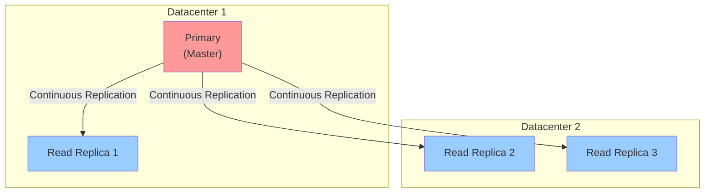
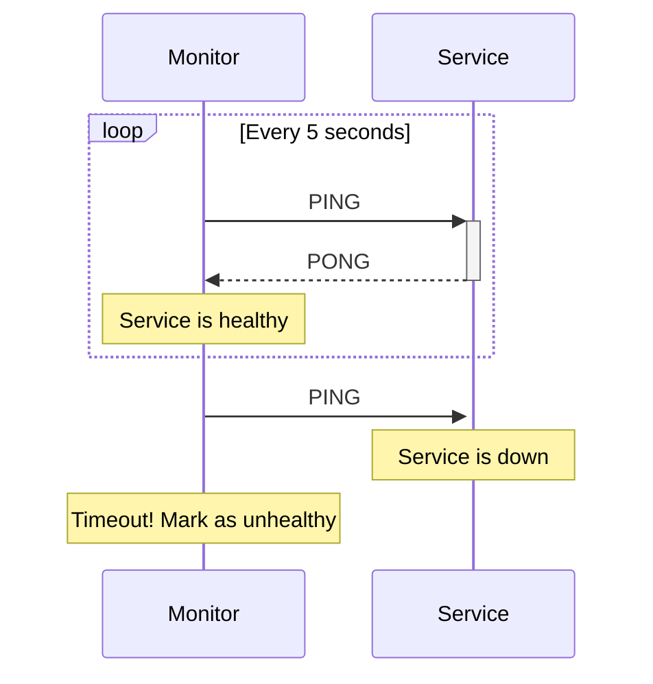
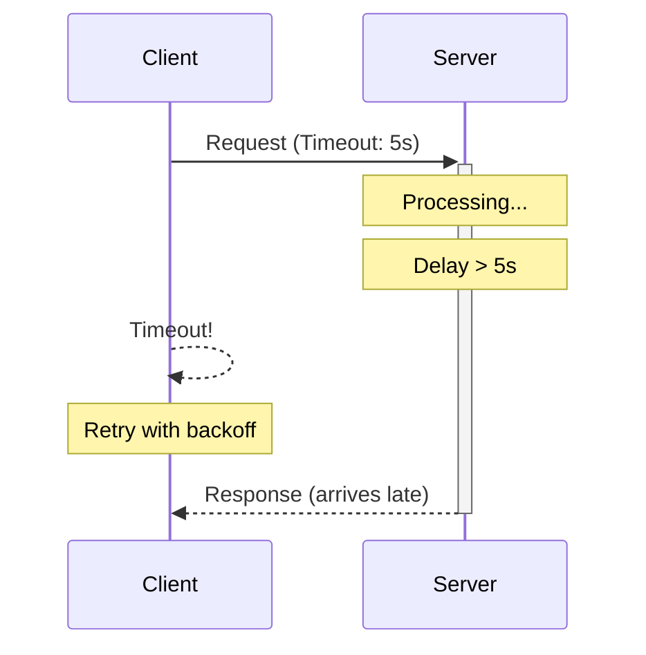
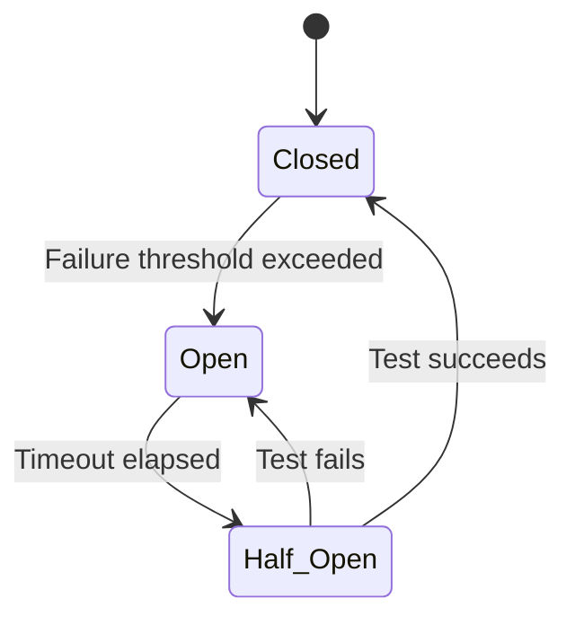
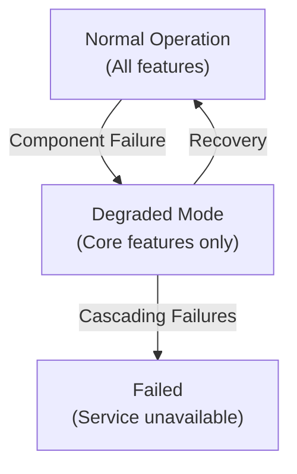
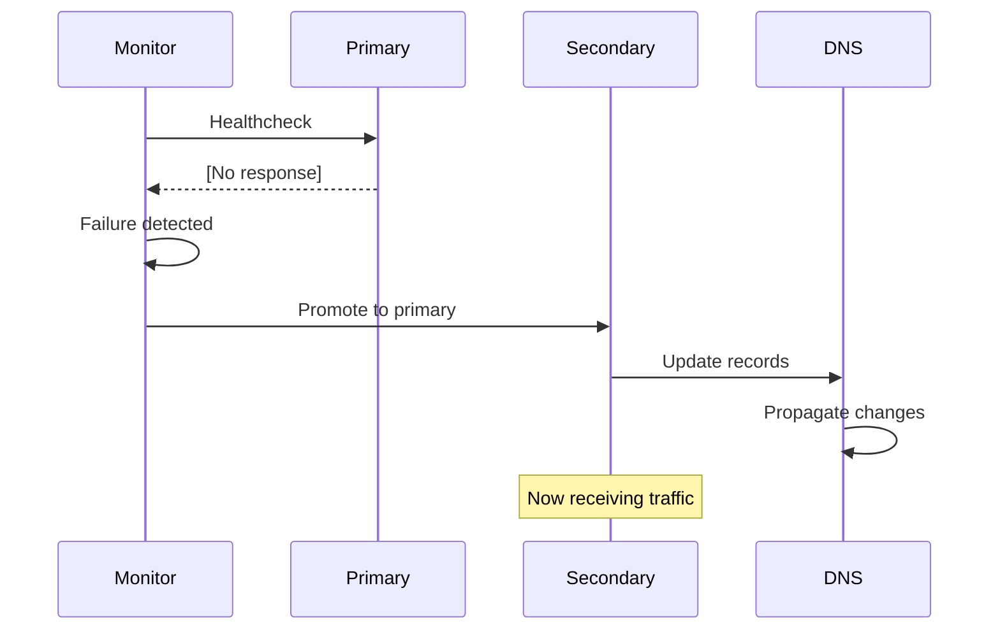

# Design - Fault-Tolerance

## Overview

Describe how your system handles and recovers from failures to maintain service availability.

## Data Replication

### Replication Model

**Strategy**: [Master-Slave / Multi-Master / Peer-to-Peer]

**Topology**:



### Replication Details

- **What Data is Replicated**: [All data / Critical data only]
- **Number of Replicas**: [2, 3, 5+]
- **Replication Lag**: [Milliseconds / Seconds / Eventually consistent]
- **Synchronous vs Asynchronous**: [Which approach?]

### Consistency Between Replicas

- **Update Propagation**: [How are updates sent to replicas?]
- **Conflict Detection**: [How are conflicts detected?]
- **Conflict Resolution**: [CRDT / Vector Clocks / Last-Write-Wins / Application-specific]

## Heartbeat and Monitoring

### Heartbeat Mechanism

**Purpose**: Detect when components fail

**Implementation**:
- **Frequency**: [Every X seconds]
- **Timeout**: [Consider dead after Y seconds]
- **Protocol**: [HTTP, TCP, UDP, custom]

**Example**:



### Components Involved

| Component   | Monitors   | Heartbeat Interval | Failure Threshold |
|-------------|------------|--------------------|-------------------|
| [Service 1] | [Monitors] | [X seconds]        | [Y failures]      |
| [Service 2] | [Monitors] | [X seconds]        | [Y failures]      |

### Monitoring and Alerting

- **Monitoring Tool**: [Prometheus/ELK/Datadog/Custom]
- **Alert Conditions**: [CPU > 80%, Latency > 1s, etc.]
- **Alert Channels**: [Email, Slack, PagerDuty, etc.]

## Timeout and Retry Mechanisms

### Retry Strategy

**When to Retry**: [Transient failures like network timeouts]

**Retry Logic**:

```python
for attempt in range(1, MAX_ATTEMPTS + 1):
    try:
        result = call_remote_service()
        return result
    except TransientException:
        if attempt < MAX_ATTEMPTS:
            wait_time = exponential_backoff(attempt)
            time.sleep(wait_time)
        else:
            raise
```

**Backoff Strategy**:
- **Type**: [Linear / Exponential / Random Exponential]
- **Initial Delay**: [X milliseconds]
- **Max Delay**: [Y milliseconds]
- **Multiplier**: [2.0 for exponential]

### Timeout Configuration

| Operation     | Timeout     | Rationale           |
|---------------|-------------|---------------------|
| [Operation 1] | [X seconds] | [Why this timeout?] |
| [Operation 2] | [Y seconds] | [Why this timeout?] |

**Example**:



## Error Handling and Recovery

### Error Classification

**Transient Errors** (Recoverable):
- Network timeouts
- Temporary unavailability
- Rate limiting
- **Action**: Retry with backoff

**Permanent Errors** (Non-recoverable):
- Authentication failures
- Data validation errors
- Resource not found
- **Action**: Log and propagate to user

**Cascading Failures**:
- One component failure triggers others
- **Action**: Circuit breaker pattern

### Circuit Breaker Pattern

**Purpose**: Prevent cascading failures



**States**:
- **Closed**: Normal operation, requests pass through
- **Open**: Failures detected, requests fail fast
- **Half-Open**: Testing if service recovered

**Configuration**:
- **Failure Threshold**: [X consecutive failures]
- **Reset Timeout**: [Y seconds before trying again]
- **Success Threshold**: [Z successful requests in half-open to close]

## Graceful Degradation

### Degraded Mode Operation

**Scenario**: [Critical component fails]

**Response**:
1. [Detect failure]
2. [Switch to degraded mode]
3. [Reduce functionality]
4. [Notify users]
5. [Maintain core functionality]

**Example**:



### Fallback Strategies

| Component   | Primary Strategy | Fallback Strategy | Fallback 2   |
|-------------|------------------|-------------------|--------------|
| [Component] | [Primary]        | [Fallback 1]      | [Fallback 2] |

## Failover and Recovery

### Failover Process

**Detection Time**: [How long to detect failure?]

**Failover Time**: [How long to complete failover?]

**Data Loss**: [Acceptable data loss during failover?]

**Procedure**:



### Automatic Recovery

- **Recovery Time Objective (RTO)**: [X minutes]
- **Recovery Point Objective (RPO)**: [Lose last Y minutes of data]
- **Automatic Restart**: [Enabled/Disabled]
- **Restart Delay**: [If exponential backoff, what's the policy?]

## Backup and Restore

### Backup Strategy

**Frequency**: [Daily / Hourly / Continuous]

**Type**: [Full / Incremental / Differential]

**Location**: [On-site / Off-site / Multiple locations]

**Retention**: [How long are backups kept?]

**Example Backup Schedule**:

```
00:00 - Full backup
06:00 - Incremental backup
12:00 - Incremental backup
18:00 - Incremental backup
```

### Restore Procedure

1. [Step 1: Assess data loss]
2. [Step 2: Prepare recovery environment]
3. [Step 3: Restore from backup]
4. [Step 4: Verify data integrity]
5. [Step 5: Resume normal operations]

**Estimated Recovery Time**: [X hours]

## Disaster Recovery Plan

### Disaster Scenarios

**Scenario 1**: [Data corruption]
- Impact: [What fails?]
- Detection: [How to detect?]
- Recovery: [Steps to recover]
- RTO/RPO: [X hours / Y hours]

**Scenario 2**: [Datacenter outage]
- Impact: [Service completely down]
- Detection: [All health checks fail]
- Recovery: [Failover to secondary datacenter]
- RTO/RPO: [Minutes / Seconds of data]

**Scenario 3**: [Cascading failures]
- Impact: [Multiple components fail]
- Detection: [Circuit breakers open]
- Recovery: [Rolling restart, health checks]
- RTO/RPO: [Variable]

### Disaster Recovery Testing

- **Test Frequency**: [Monthly / Quarterly / Annually]
- **Test Type**: [Full / Partial / Simulation]
- **Test Results**: [Document findings and improvements]
