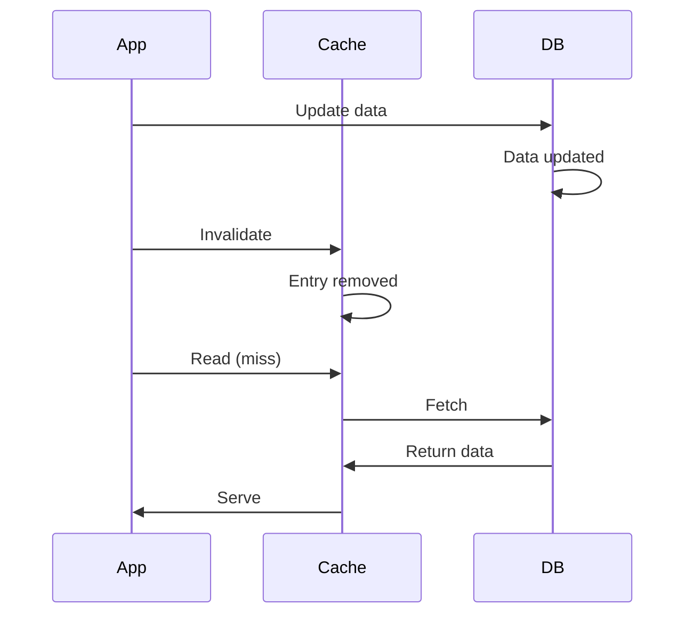
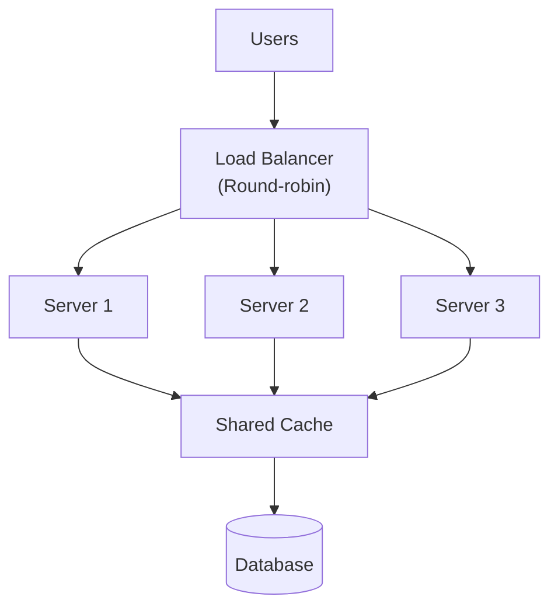
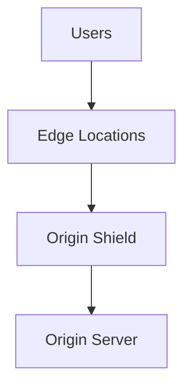

# Design - Availability

## Caching Strategy

### Where is Caching Used?

| Cache Layer | Purpose          | Cache Type              | Storage             |
|-------------|------------------|-------------------------|---------------------|
| [Layer 1]   | [Speed up reads] | [In-memory/Distributed] | [Redis/Memcached]   |
| [Layer 2]   | [Reduce DB load] | [Query cache]           | [Redis/Memcached]   |
| [Layer 3]   | [Client-side]    | [Browser cache]         | [LocalStorage/HTTP] |

### Cache Types

**In-Memory Cache** (Single instance)
- [Use for single-server deployments]
- [Pro: Fast, simple]
- [Con: Lost on restart, can't be distributed]

**Distributed Cache** (Shared across servers)
- [Use for multi-server deployments]
- [Pro: Shared between servers, persistent]
- [Con: Network latency, requires coordination]

**Browser Cache**
- [HTTP caching headers]
- [LocalStorage for client-side data]
- [Pro: Reduces server load]
- [Con: Cache invalidation challenges]

### Cache Invalidation

**Strategy**: [Time-based / Event-based / Manual / Hybrid]

**Implementation**:

```
Time-based:
- Cache expiry: 5 minutes
- Stale-while-revalidate: Update in background

Event-based:
- On data update, invalidate related caches
- Publish cache invalidation event

Example:
User updates profile → Invalidate cache[user:123]
```

**Cache Stampede Prevention**:
- [Use locks during cache refresh]
- [Use probabilistic early expiration]
- [Use stale cache temporarily]

### Cache Coherency

**Consistency Level**: [Strong / Eventual]

**Update Propagation**:



## Load Balancing

### Load Balancing Strategy

**Type**: [Round-robin / Least connections / IP hash / Weighted / Application-aware]

**Location**: [API Gateway / DNS / External LB / Internal LB]

**Example Topology**:



### Load Balancing Algorithms

**Round-Robin**
- [Distribute equally across all servers]
- [Pro: Simple, fair]
- [Con: Doesn't account for server load]

**Least Connections**
- [Route to server with fewest active connections]
- [Pro: Better load distribution]
- [Con: Higher overhead]

**Weighted Round-Robin**
- [Assign weights based on server capacity]
- [Pro: Account for heterogeneous servers]
- [Con: Requires manual configuration]

**IP Hash**
- [Route based on client IP]
- [Pro: Session persistence]
- [Con: Can cause load imbalance]

### Session Affinity (Sticky Sessions)

**Enabled**: [Yes / No]

**Reason**: [If yes, why? If no, why?]

**Implementation**: [Cookie-based / IP-based / Token-based]

## Horizontal Scaling

### Scalability Strategy

**Auto-Scaling Triggers**:

| Metric          | Lower Bound | Upper Bound | Action         |
|-----------------|-------------|-------------|----------------|
| CPU Usage       | 20%         | 80%         | Scale in / out |
| Memory Usage    | 30%         | 90%         | Scale in / out |
| Request Latency | 100ms       | 500ms       | Scale in / out |
| Request Queue   | 0           | 100         | Scale out      |

**Scaling Policies**:

```
CPU > 80% → Add instance
CPU < 20% for 10 min → Remove instance
Max instances: 10
Min instances: 2
```

### Scaling Challenges

**Stateful Components**:
- [Problem: State not shared between instances]
- [Solution: External state store / Session affinity / Replication]

**Database Scaling**:
- [Vertical scaling: Increase server resources]
- [Horizontal scaling: Sharding / Read replicas / Partitioning]

**Session Management**:
- [Store in database / Cache / Client-side (JWT)]

## Geographic Distribution

### Multi-Datacenter Architecture

```mermaid
graph TB
    subgraph US["US Region"]
        USLBhttps://example.com["Load Balancer"]
        US1["Server 1"]
        US2["Server 2"]
    end
    
    subgraph EU["EU Region"]
        EULB["Load Balancer"]
        EU1["Server 1"]
        EU2["Server 2"]
    end
    
    subgraph Asia["Asia Region"]
        AsiaLB["Load Balancer"]
        Asia1["Server 1"]
        Asia2["Server 2"]
    end
    
    DNS["Global DNS\n(GeoDNS)"]
    DB1[("Primary DB\n(US)")]
    DB2[("Replica DB\n(EU)"]
    DB3[("Replica DB\n(Asia)"]
    
    DNS -->|Route to closest| USLB
    DNS -->|Route to closest| EULB
    DNS -->|Route to closest| AsiaLB
    
    USLB --> US1
    USLB --> US2
    EULB --> EU1
    EULB --> EU2
    AsiaLB --> Asia1
    AsiaLB --> Asia2
    
    US1 --> DB1
    EU1 --> DB2
    Asia1 --> DB3
```

### Geographic Failover

**Strategy**: [Manual / Automatic / Hybrid]

**Detection**: [Health checks per region]

**Failover Time**: [RTO target]

**Data Consistency**: [Replication lag between regions]

## CDN Integration

### Content Delivery Network

**Purpose**: Distribute static content geographically

**Content Types**: [Images / Videos / CSS / JS / HTML]

**CDN Provider**: [CloudFlare / Akamai / AWS CloudFront / etc.]

**Cache Control**:

```
Cache-Control: max-age=31536000  // Cache for 1 year
Cache-Control: max-age=3600      // Cache for 1 hour
Cache-Control: no-cache          // Revalidate on every request
```

### Origin Shield

**Purpose**: Protect origin server from cache stampedes

**Diagram**:



## Queue and Backpressure

### Message Queue

**Purpose**: Decouple producers and consumers

**Technology**: [RabbitMQ / Kafka / SQS / NATS]

**Configuration**:

```
Queue size: 10,000 messages
Max delivery attempts: 3
Message TTL: 24 hours
Dead letter queue: For failed messages
```

### Backpressure Handling

**Strategy**: [Drop / Queue / Rate Limit / Block]

**Example**:

```
If queue size > 90%:
  → Reject new requests (503 Service Unavailable)
  → Clients should retry later
  → Prevents system overload
```

## Rate Limiting

### Rate Limiting Strategy

**Level**: [Global / Per-user / Per-IP / Per-API-key]

**Algorithm**: [Token bucket / Sliding window / Leaky bucket]

**Limits**:

| Endpoint      | Limit        | Window   |
|---------------|--------------|----------|
| `/api/users`  | 100 requests | 1 minute |
| `/api/search` | 10 requests  | 1 second |
| `/api/upload` | 50 MB        | 1 hour   |

### Rate Limiting Response

```
HTTP 429 Too Many Requests

Retry-After: 60
X-RateLimit-Limit: 100
X-RateLimit-Remaining: 0
X-RateLimit-Reset: 1699729800
```

## Circuit Breaking and Bulkheads

### Circuit Breaker Thresholds

| Service   | Failure Rate | Timeout | Half-Open Requests |
|-----------|--------------|---------|--------------------|
| Auth      | 50%          | 2s      | 5                  |
| Payment   | 10%          | 5s      | 3                  |
| Analytics | 90%          | 10s     | 1                  |

### Bulkhead Pattern

**Purpose**: Isolate failures to specific parts

```
Thread Pool 1 (Auth): 10 threads
Thread Pool 2 (Payment): 20 threads
Thread Pool 3 (Analytics): 5 threads

If Thread Pool 3 becomes unavailable,
other pools continue operating
```
